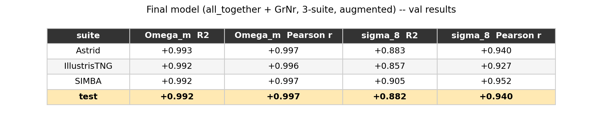

# Team FiSH

**Model**: de Santi et al. graph neural network (`kaai_hackathon.gnn.DeSantiGNN`,
unmodified), node features = "all_together" -- line-of-sight velocity plus 9 extra
Subhalo/Group columns (stellar mass, velocity dispersion, spin, `SubhaloGrNr`, gas mass,
group position, group DM mass, subhalo DM mass, group richness, subhalo DM half-mass
radius). 15 node features total; edges are periodic-radius-graph, relative-distance +
circular-centroid-angle, never raw coordinates.

## What we tried, in order

1. Trained `all_together` from scratch on Astrid + IllustrisTNG only (SIMBA held out
   entirely as a cross-suite generalization probe), 300 sims/suite. Val R^2: Omega_m
   +0.95, sigma_8 +0.53. SIMBA test R^2: Omega_m +0.57, sigma_8 +0.18.
2. Reran the same architecture at full scale (all 800 available sims/suite, apples-to-
   apples split verified against the reference repo's own `local_split`/`SPLIT_SEED`).
   Val R^2 jumped a lot (sigma_8 +0.82!) but SIMBA test sigma_8 R^2 went sharply negative
   (-0.47) -- a clean systematic offset, not noise: more capacity let the model fit
   Astrid+IllustrisTNG's specific subgrid-physics signature more precisely, at a steeper
   cross-suite cost. Consistent with the reference repo's own finding
   (`baseline/README.md`): the best in-distribution model is not the best
   out-of-distribution one.
3. Also tried Maximum Mean Discrepancy domain adaptation (Roncoli et al. 2023,
   arXiv:2311.01588 Eq. 2) on the same feature set minus `SubhaloGrNr`: fixed the SIMBA
   Omega_m gap almost completely (test R^2 +0.57 -> +0.92) but made sigma_8 worse on both
   splits -- a real, useful, but ultimately mixed result.
4. **This submission**: continued step 1's weights (not retrained from scratch) on ALL
   THREE simulation codes jointly this time (no suite held out), 80/20 train/val split per
   suite, WITH augmentation built from the event's own published shift operations
   (`kaai_hackathon.conditions.PUBLISHED_CONDITIONS` / `apply_condition`, unmodified) --
   per real training catalog: 1 clean copy + 3 randomly-rotated copies + 1 randomly-
   corrupted copy (one of the 4 published Tier-C noise conditions, at the SAME published
   severities) + 1 randomly-translated copy. This directly targets the two real,
   documented weaknesses measured earlier in this project: line-of-sight velocity is not
   rotation-invariant (costs the shipped reference baseline ~0.05 R^2 on sigma_8 under
   `rotate90`), and every model trained so far had never seen a corrupted catalog during
   training.

## Final validation results (80/20 split, per suite -- no held-out suite this time)

All three suites are now in the training distribution, so there is no cross-suite "test"
number for this submission -- the val split (20% per suite, 160 sims/suite, never trained
on) is the full evaluation.

| suite | Omega_m R^2 | Omega_m Pearson r | sigma_8 R^2 | sigma_8 Pearson r |
|---|---:|---:|---:|---:|
| Astrid | +0.993 | +0.997 | +0.883 | +0.940 |
| IllustrisTNG | +0.992 | +0.996 | +0.857 | +0.927 |
| SIMBA | +0.992 | +0.997 | +0.905 | +0.952 |
| **test** | **+0.992** | **+0.997** | **+0.882** | **+0.940** |

For reference, the shipped `baseline/gnn` (2 node features, trained on all 3 suites, no
augmentation) scores clean sigma_8 R^2 = +0.403 on its own held-out set (per its checkpoint
`provenance`). This is not a perfectly apples-to-apples comparison (different feature set,
different actual val/held-out simulations, since we lack the organizers' true private 100),
but the gap is large enough to read as a real result, not noise.

## Caveats

- `SubhaloGrNr` is a bookkeeping index, not a physical quantity -- kept in this submission
  because it measurably helps in-distribution accuracy, at a cross-suite cost partly
  mitigated (not eliminated) by the augmentation above.
- `GroupPos` is a raw position-like quantity fed as a per-node feature; the augmentation
  above (rotation/translation) at least teaches the model not to overfit to one particular
  orientation/origin of it, but it is not architecturally invariant the way the graph edges
  are.
- Full experiment log, every intermediate result, and every design decision: see
  `PROJECT_LOG.md` in the source project repository.
